# petro-image

An open-source, web-based platform for exploring and analyzing high-resolution digital microscopic images.

**Try it out here**: [https://grsharman.github.io/petro-image/](https://grsharman.github.io/petro-image/)

By [Glenn R. Sharman](https://github.com/grsharman) and [Jonathan P. Sharman](https://github.com/jonathansharman)

> [!NOTE]
> petro-image is still under development. Check back for updates!

## Table of Contents

- [Overview](#overview)
- [Image Selection](#image-selection)
- [Adding Your Own Images](#adding-your-own-images)
- [Transform Imagery: Polarization Analysis](#transform-imagery-polarization-analysis)
- [Tools](#tools)
- [Appendix](#appendix)

## Overview

petro-image is a web-hosted tool for viewing and analyzing digital microsopic images using the [OpenSeadragon](https://openseadragon.github.io/) JavaScript library and the [Deep Zoom](<https://learn.microsoft.com/en-us/previous-versions/windows/silverlight/dotnet-windows-silverlight/cc645077(v=vs.95)?redirectedfrom=MSDN>) file format. Vector drawings follow the [GeoJSON file standard](https://geojson.org/), where x, y coordinates are in image dimensions (pixels).

For a given specimen, petro-image allows up to four images to be displayed simultaneously, with the boundary between the images dynamically following the user's curser (inspired by [this example](https://rooneyt.msu.domains/Demonstration_1.html)). If multiple angles of plain- or cross-polarized light are available, then adjacent images can be blended to mimic the effects of rotating the stage on a petrographic microscope. Alternatively, images may be superimposed and opacity adjusted such that multiple layers are visible simultaneously.

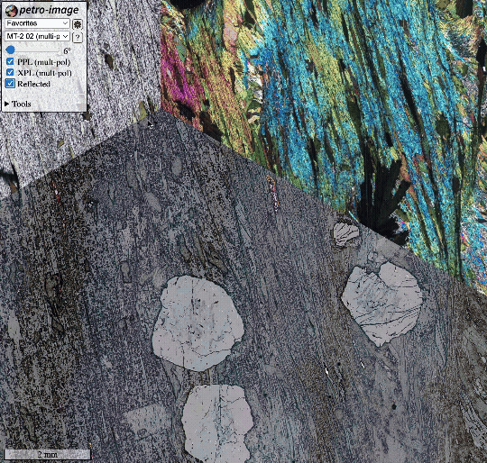

petro-image includes basic functions for [measuring](#measure), [annotating](#annotate), [gridding](#grid), and [point counting](#count).

At present, petro-image mostly hosts petrographic thin sections of sediment and sedimentary rock. If you would like to contribute specimens to the petro-image library or have suggestions for improvements, please contact Dr. Glenn Sharman at gsharman@uark.edu.

## Image Selection

<b><i>petro-image</i></b> has two drop-down menus. The top menu is used to select a group of specimens, and the bottom menu is used to select the specimen or sample of interest. Setting the top menu to "All" will return all available specimens.

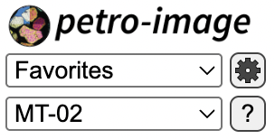

The angle of image rotation can be controlled using the slider below the drop-down menus. Pressing "r" or "R" keys rotates the image in 90 degree increments. Ctrl+scrolling will also control image rotation.

Individual specimens can have between 1 and 4 images that can be displayed simultaneously. Individual images may be toggled on/off using the checkboxes.

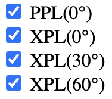

Clicking on the  button will enable a set of options that include toggling on/off the “Divide Images” setting and adjusting the opacity of the individual layers. See [Layer Explanation](#layer-explanation) for an explanation of how images are superimposed. Clicking on the  button allows the user to upload a custom JSON that contains their own images for display (see the [Adding Your Own Images](#adding-your-own-images) and [JSON File Structure](#json-file-structure) sections for more information).

Hovering your curser over the  icon will display a description of the sample, if available.

## Adding Your Own Images

1. Acquire one or more digital images of your sample. Most of the images currently hosted on petro-image were created using the [PiAutoStage](https://sites.google.com/msu.edu/piautostage/home), which is described in [Reiner and Rooney (2021)](https://doi.org/10.1029/2021GC009693).
2. Convert digital image(s) (e.g., TIF, JPG) to the deep-zoom file format, which consists of a DZI file and an associated folder with tiled images. A variety of [methods for converting to deep-zoom files](https://openseadragon.github.io/examples/creating-zooming-images/) are available.
3. Make the DZI files publicly available on the web. Uploading the files to a public GitHub repository is one way to do this. Determine the URL that points to the DZI file for each image.
4. Create a JSON file that contains an entry for each specimen, which could have one or more associated images. See the [JSON File Structure](#json-file-structure) section for details.
5. Load the JSON file into petro-image by clicking on the  icon followed by the  button on the pop-up menu.

> [!NOTE]
> If using more than one image, they should align as closely as possible and have the same number of rows and columns.

> [!NOTE]
> You must know pixel dimensions of your image(s).

### AxioScan 7 CZI Import (Desktop Beta)

The Electron desktop app has an **Actions → Import AxioScan 7 CZI** workflow for single-scene, 2D AxioScan 7 scans. The workflow discovers whichever lighting channels were scanned, preserves their shared registered extent, offers reduced-resolution output, generates DZI pyramids in the active project's `dzi` folder, and can add the result to the current library or create a new library. The converter reads approximately 4,096-pixel CZI batches and slices them into standard 254-pixel DZI tiles to avoid per-tile CZI call overhead. The wizard supports group assignment and tile-set ordering. Multiple PPL or XPL angles are combined into rotation-aware tile sets; a single PPL/XPL angle and every Brightfield or CPL channel remain individual tile sets. **Advanced diagnostics** contains the conversion performance breakdown and a CZI read benchmark that compares 254–4,096-pixel reads on a centered region of one selected channel without creating image or library files.

Packaged desktop releases include a platform-specific, one-folder CZI worker containing Python, `pylibCZIrw`, NumPy, and Pillow. Users of a packaged release do not need to install or configure Python.

Running the app directly from the source tree still uses a configured Python environment. For development, install the dependencies before launching petro-image:

```sh
python3 -m pip install pylibCZIrw==6.1.0 numpy Pillow
```

Release builds create the standalone worker automatically before packaging:

```sh
npm run build:czi-worker
npm run package
```

The first build creates `.venv-czi-build`, installs the pinned dependencies from `scripts/czi-worker-requirements.txt`, and writes the generated resource to `build/czi-worker`. Workers are native artifacts and must be built separately on each supported operating system and processor architecture. Z-stacks, time series, multiple scenes, and other general CZI layouts are rejected by this targeted beta.

macOS development packages are ad-hoc signed after all native worker resources are added. For a distributable release, set `PETRO_IMAGE_MAC_SIGN_IDENTITY` to the installed Developer ID Application identity; Apple notarization remains a separate release-credential step.

### JPEG 2000 Import (Desktop Beta)

The desktop image importer accepts JPEG 2000 still images (`.jp2`, `.j2k`, `.j2c`, `.jpc`, `.jpx`, and `.jpf`) and converts them directly to a standard 254-pixel, 1-pixel-overlap JPEG DZI pyramid. Conversion runs in a bundled libvips worker compiled with OpenJPEG, keeping large source decoding outside Electron and avoiding a full-size intermediate TIFF or PNG. Complex multi-codestream JPX compositions, JPM compound documents, and Motion JPEG 2000 (`.mj2`) are not supported.

JPEG 2000 sources can contain more precision than the display pyramid. The current importer creates quality-90, 8-bit JPEG tiles, so 16-bit precision, alpha, and lossless source encoding are not retained in the DZI derivative.

Release builds create the platform-specific worker automatically. The build uses pinned conda-forge packages and needs a Conda installation; set `PETRO_IMAGE_CONDA` if `conda` is not on `PATH`:

```sh
PETRO_IMAGE_CONDA=/path/to/conda npm run build:vips-worker
```

The generated worker is written to `build/vips-worker`, includes third-party license material, and is bundled into packaged desktop releases. It must be built separately for each supported operating system and processor architecture. Development runs use this staged worker automatically when it exists, or `PETRO_IMAGE_VIPS_PATH` can point to another OpenJPEG-enabled `vips` executable.

Before releasing large-file support, benchmark a representative scan. The benchmark retains its DZI output so it can be inspected and reports source size, pixel dimensions, elapsed time, and output size:

```sh
npm run benchmark:jpeg2000 -- /path/to/scan.jp2 /path/to/benchmark-output
```

On macOS, `/usr/bin/time -l` can wrap that command to record peak resident memory. Ensure the destination has ample free space: a large DZI includes approximately one third more source pixels across its reduced pyramid levels before JPEG compression.

## Transform Imagery: Polarization Analysis

Polarization Analysis derives pixel-scale optical-response products from registered images acquired at multiple polarization angles. It is intended to quantify patterns that are visible while rotating a petrographic stage; it does not identify minerals or directly determine crystallographic orientation. The calculations and classification rules below describe the current implementation.

### Inputs, coordinates, and acquisition assumptions

The user assigns tile sets to the PPL, XPL, and, where applicable, CPL roles. This assignment is stored independently of optional acquisition metadata, so older samples without acquisition parameters remain usable. A fitted product requires at least three finite angles that produce a nonsingular design matrix. More observations with broad angular coverage are strongly preferred; six PPL and six XPL images are the normal target.

The current XPL model assumes that the polarizer and analyzer are crossed at 90° and rotate together. This has the same relative optical effect as keeping the crossed polars fixed while rotating the specimen stage. Reported angles use the image-coordinate convention and the supplied acquisition angles. They are not automatically converted to geographic, specimen, or crystallographic coordinates.

Calculations may use red, green, blue, or luminance intensity. Luminance is

$$
Y = 0.2126R + 0.7152G + 0.0722B.
$$

The anisotropy classifier always uses luminance. Its default intensity thresholds assume 8-bit data numbers (DN) on a 0–255 scale. Registration, illumination, exposure, white balance, camera response, and specimen thickness should be consistent among images. Differences in any of these can be fitted as apparent angular variation.

### Harmonic response models

For each pixel, the application fits the observations by ordinary, unweighted least squares:

$$
I(\theta_i)=a+b\cos(h\theta_i)+c\sin(h\theta_i)+\varepsilon_i,
$$

where $I(\theta_i)$ is the selected-channel intensity at acquisition angle $\theta_i$, $a$ is the fitted mean, $b$ and $c$ are harmonic coefficients, and $h$ is the harmonic number. Angles are converted to radians during fitting. In matrix form,

$$
\hat{\boldsymbol\beta}=
(\mathbf X^\mathsf T\mathbf X)^{-1}\mathbf X^\mathsf T\mathbf I,
\qquad
\hat{\boldsymbol\beta}=[a,b,c]^\mathsf T.
$$

PPL uses $h=2$, giving a 180° period appropriate for a bidirectional maximum-transmission axis. XPL uses $h=4$, giving a 90° period for the repeated extinction/maximum cycle under crossed polars. The fitted amplitude and extrema are

$$
A=\sqrt{b^2+c^2},\qquad
I_{\min}=a-A,\qquad
I_{\max}=a+A,
$$

and normalized modulation is

$$
M=\frac{A}{|a|}.
$$

$M$ is dimensionless. The unnormalized amplitude $A$ has the same intensity units as the source. Although display ranges are normally 0–255 for intensity and 0–1 for normalized modulation, an unconstrained least-squares fit can produce extrema outside 0–255 or $M>1$, particularly for noisy or poorly sampled data.

The fitted maximum azimuth is

$$
\theta_{\max}=
\operatorname{mod}\!\left[
\frac{180^\circ}{\pi h}\operatorname{atan2}(c,b),\frac{360^\circ}{h}
\right],
$$

and the minimum azimuth is

$$
\theta_{\min}=
\operatorname{mod}\!\left[
\theta_{\max}+\frac{180^\circ}{h},\frac{360^\circ}{h}
\right].
$$

Thus PPL maximum-transmission azimuth is reported on $[0,180^\circ)$ and XPL extinction azimuth on $[0,90^\circ)$. These are axial, not directional, measurements: 0° and 180° describe the same PPL axis, while equivalent XPL extinction positions repeat every 90°.

Fit error is reported as the root mean square residual

$$
\operatorname{RMSE}=\sqrt{\frac{1}{n}
\sum_{i=1}^{n}\left[I_i-\hat I(\theta_i)\right]^2}.
$$

This is a descriptive RMSE divided by $n$, not a residual standard error divided by $n-3$. With exactly three observations, the three-parameter model is exactly determined and normally has zero residual degrees of freedom. Such a fit can interpolate all three observations but cannot independently test model adequacy; the UI marks it as an exact fit with residual unchecked, and fit quality is capped as described below.

### Calculated products

| Calculation | Definition | Units and nominal display range | Interpretation |
| --- | --- | --- | --- |
| PPL modulation | $A=\sqrt{b^2+c^2}=\frac{I_{\max}-I_{\min}}{2}$ | intensity, 0–255 | Fitted half-range of the PPL response. Unlike an observed range, it uses all angular observations. |
| PPL normalized modulation | $\frac{A}{\lvert a\rvert}$ | ratio, nominally 0–1 | Relative PPL modulation, reducing dependence on absolute brightness. |
| PPL predicted maximum transmission | $a+A$ from the $h=2$ fit | intensity, 0–255 | Synthetic intensity at the fitted maximum-transmission orientation. |
| PPL predicted minimum transmission | $a-A$ from the $h=2$ fit | intensity, 0–255 | Synthetic intensity at the orthogonal fitted minimum-transmission orientation. |
| PPL maximum-transmission azimuth | $\theta_{\max}$ for $h=2$ | degrees, 0–180 | Bidirectional image-coordinate axis of fitted maximum transmission. |
| PPL fit RMSE | RMSE of the $h=2$ fit | intensity, 0–64 display scale | Residual mismatch between observations and the harmonic model. |
| XPL modulation | $A=\sqrt{b^2+c^2}=\frac{I_{\max}-I_{\min}}{2}$ | intensity, 0–255 | Fitted half-range of the XPL response. |
| XPL normalized modulation | $\frac{A}{\lvert a\rvert}$ | ratio, nominally 0–1 | Relative angular XPL modulation. |
| XPL predicted maximum | $a+A$ from the $h=4$ fit | intensity, 0–255 | Synthetic XPL intensity at the fitted maximum. |
| XPL predicted minimum | $a-A$ from the $h=4$ fit | intensity, 0–255 | Synthetic XPL intensity at fitted extinction. |
| XPL extinction azimuth | $\theta_{\min}$ for $h=4$ | degrees, 0–90 | Image-coordinate extinction azimuth, repeated every 90°. |
| XPL fit RMSE | RMSE of the $h=4$ fit | intensity, 0–64 display scale | Residual mismatch between observations and the harmonic model. |
| CPL − predicted XPL maximum | $I_{\mathrm{CPL}}-I_{\mathrm{XPL,max}}$ | intensity, −255–255 | Empirical signed difference between the CPL image and fitted maximum XPL intensity. Positive values are brighter in CPL. |
| Anisotropy class | decision rules below | integer code, 0–5 | Pixel-scale optical-behavior class, not a mineral identification. |
| Anisotropy confidence | class-specific evidence score below | ratio, 0–1 | Heuristic support for the assigned class. It is not a probability. |

Simple observed mean and range are intentionally not duplicated as Polarization products. They can be calculated in Image Calculator, for example with `mean(A.l)` or `range(A.l)`. PPL and XPL modulation are fitted amplitudes $A$—half the corresponding predicted maximum-to-minimum differences—not raw observed ranges.

The CPL difference assumes that CPL and XPL images are registered and radiometrically comparable. It should not by itself be interpreted as retardation, maximum birefringence, mineral identity, or crystallographic orientation.

### Synthetic RGB output

RGB output is available for the predicted PPL maximum, predicted PPL minimum, predicted XPL maximum, and predicted XPL minimum. A luminance fit first determines one physically consistent target angle $\theta^*$. Red, green, and blue are then fitted independently and evaluated at that shared angle:

$$
\mathbf I_{\mathrm{RGB}}(\theta^*)=
\left[
\hat I_R(\theta^*),
\hat I_G(\theta^*),
\hat I_B(\theta^*)
\right].
$$

Using one luminance-derived angle prevents each color channel from selecting a different synthetic orientation. Scalar and false-color outputs instead use the channel selected in the UI. Azimuth is available as a separate calculation and is not appended to the RGB cursor value.

### Fit at cursor, histogram, and rose diagram

**Fit at cursor** plots the angular observations and fitted curve for the pixel under the cursor. It reports fitted minimum, maximum, amplitude, normalized modulation, azimuth, RMSE, and normalized RMSE. Double-clicking the image pins the sampled point so the cursor can be moved to inspect the chart without changing it.

For analytical previews, the histogram and rose diagram use a common, approximately uniform screen-space sample of up to 30,000 points from the visible viewport. Each screen position samples the highest-resolution loaded analytical tile available there. Consequently, larger visible areas contribute proportionally more observations, while viewer background and positions without a calculated value are excluded. The displays are representative samples of the current view rather than exhaustive statistics over the entire source image.

The histogram, rose diagram, and azimuth preview share a fit filter. **All**, the default, includes every finite fitted azimuth. **Reliable** retains pixels that satisfy the fit-error, normalized-modulation, and signal tests associated with the selected classification preset; pixels that fail those tests are shown in neutral grey on the preview without changing their analytical values. Both statistical views report the included fraction and number of sampled pixels.

The rose diagram is available for azimuth products. It treats the measurements as axial by expanding each PPL observation to $\theta$ and $\theta+180^\circ$, and each XPL observation to $\theta$, $\theta+90^\circ$, $\theta+180^\circ$, and $\theta+270^\circ$. PPL uses 10° bins and XPL uses 5° bins. Bin radius is linear in sample count.

### Pixel-based anisotropy classification

The classifier combines observed luminance statistics with the PPL and XPL fits. Its classes describe image behavior:

| Code | Class | Required evidence |
| ---: | --- | --- |
| 0 | Unresolved / poor fit | No supported class, missing or conflicting evidence, poor fit, or confidence below the selected minimum. |
| 1 | Opaque-like / very low transmission | Very low PPL transmission. A single PPL image can provide limited evidence. |
| 2 | Isotropic-like / continuously extinct | Transmissive, reliably non-pleochroic PPL response plus continuously dark XPL. |
| 3 | Pleochroic | Reliable PPL modulation without reliable positive XPL evidence. |
| 4 | Birefringent | Reliable XPL modulation without reliable positive PPL evidence. |
| 5 | Pleochroic + birefringent | Reliable positive PPL and XPL responses. |

“Opaque-like” and “isotropic-like” are deliberately qualified. A dark pixel may reflect absorption, thickness, polishing, illumination, registration, or sensor limitations. Likewise, continuous XPL darkness can resemble isotropic behavior without proving mineral isotropy.

#### Presets and thresholds

The symbols below are used in the decision and confidence equations.

| Symbol | UI threshold | Conservative | Balanced | Sensitive |
| --- | --- | ---: | ---: | ---: |
| $L$ | Low PPL transmission (DN) | 12 | 15 | 20 |
| $D$ | XPL extinction ceiling (DN) | 8 | 12 | 18 |
| $P$ | Minimum PPL normalized modulation | 0.12 | 0.08 | 0.05 |
| $P_{\mathrm{abs}}$ | Minimum PPL amplitude (DN) | 6 | 4 | 3 |
| $X$ | Minimum XPL normalized modulation | 0.22 | 0.15 | 0.10 |
| $E_{\max}$ | Maximum normalized fit error | 0.08 | 0.12 | 0.18 |
| $C_{\min}$ | Minimum classification confidence | 0.50 | 0.35 | 0.25 |

The presets are heuristic starting points, not universally calibrated physical boundaries. Changing acquisition conditions or bit depth generally requires validation and possibly custom thresholds.

#### Fit reliability and evidence functions

For either fit, the normalization scale and normalized fit error are

$$
s=\max(|a|,A,1),\qquad e=\frac{\operatorname{RMSE}}{s}.
$$

The fit is called reliable when $e\le E_{\max}$. Its quality score is

$$
q=
\begin{cases}
\operatorname{clip}_{[0,1]}\left(1-\frac{1}{2}\frac{e}{E_{\max}}\right), & e\le E_{\max},\\[4pt]
\operatorname{clip}_{[0,1]}\left(\frac{1}{2}\frac{E_{\max}}{\max(e,\epsilon)}\right), & e>E_{\max}.
\end{cases}
$$

For three or fewer observations, $q$ is capped at 0.55 because the residual is not an independent check on the three-parameter fit.

Evidence relative to a positive threshold $t$ is scored as

$$
E_+(v,t)=\operatorname{clip}_{[0,1]}
\left(0.5+\frac{v-t}{2\max(t,\epsilon)}\right),
$$

while evidence that a value lies below a threshold is

$$
E_-(v,t)=\operatorname{clip}_{[0,1]}
\left(0.5+\frac{t-v}{2\max(t,\epsilon)}\right).
$$

A value exactly at its decision threshold therefore has evidence 0.5. These linear scores quantify separation from the selected thresholds; they are not likelihood functions.

#### Decision rules and confidence

Let $M_P$, $A_P$, and $q_P$ denote PPL normalized modulation, amplitude, and fit quality, and let $M_X$, $A_X$, and $q_X$ denote their XPL equivalents. The PPL amplitude noise floor is

$$
N_P=\max\left(P_{\mathrm{abs}},
\begin{cases}
2\operatorname{RMSE}_P,& n_P>3,\\
0,& n_P\le3.
\end{cases}\right).
$$

PPL-positive requires a reliable fit, $M_P\ge P$, and $A_P\ge N_P$. Its evidence is

$$
C_P=\min\left[E_+(M_P,P),E_+(A_P,\max(N_P,1)),q_P\right].
$$

XPL-positive requires a reliable fit, an observed XPL maximum greater than $D$, $M_X\ge X$, and $A_X\ge2$ DN. Its evidence is

$$
C_X=\min\left[E_+(M_X,X),E_+(A_X,2),q_X\right].
$$

Several rules use conservative maxima. Let $I_{P,\mathrm{obs}}^{\max}$ and $I_{X,\mathrm{obs}}^{\max}$ be observed maxima and let $I_{P,\mathrm{fit}}^{\max}$ and $I_{X,\mathrm{fit}}^{\max}$ be predicted maxima from reliable fits. The implementation defines

$$
I_{P,\mathrm{opaque}}=
\begin{cases}
\max(I_{P,\mathrm{obs}}^{\max},I_{P,\mathrm{fit}}^{\max}),& \text{reliable PPL fit},\\
I_{P,\mathrm{obs}}^{\max},& \text{otherwise},
\end{cases}
$$

$$
I_{X,\mathrm{dark}}=
\begin{cases}
\max(I_{X,\mathrm{obs}}^{\max},I_{X,\mathrm{fit}}^{\max}),& \text{reliable XPL fit},\\
I_{X,\mathrm{obs}}^{\max},& \text{otherwise},
\end{cases}
$$

and uses the reliable fitted PPL maximum, when available, as the PPL transmission estimate $I_{P,\mathrm{trans}}$; otherwise it falls back to the observed PPL maximum. These choices prevent an undersampled observation or a fitted curve alone from making the pixel appear darker than the combined evidence supports.

- **Opaque-like:** the observed PPL maximum must be $\le L$, and a reliable predicted PPL maximum, if available, must also be $\le L$. Confidence is $E_-(I_{P,\mathrm{opaque}},\max(L,1))s_P$, where $s_P=0.8$ for one PPL observation and 1 otherwise.
- **Isotropic-like:** at least three XPL observations must satisfy $I_{X,\mathrm{dark}}\le D$; a reliable PPL fit from at least three images must not be PPL-positive. Confidence is $\min[E_+(I_{P,\mathrm{trans}},\max(L,1)),E_-(I_{X,\mathrm{dark}},\max(D,1))]s_X$, where $s_X=0.65$ for exactly three XPL observations and 1 for more than three.
- **Pleochroic + birefringent:** both tests are positive and confidence is $\min(C_P,C_X)$.
- **Pleochroic:** only PPL is positive and confidence is $C_P$. It is multiplied by 0.75 when XPL exists but is neither reliably fitted nor continuously dark.
- **Birefringent:** only XPL is positive and confidence is $C_X$. It is multiplied by 0.75 when a PPL fit exists but is unreliable.
- **Unresolved:** when neither response is positive, the retained confidence is at most half of the better available fit-quality score. Any provisional nonzero class with confidence below $C_{\min}$ is reassigned to unresolved while retaining its evidence score.

Accordingly, **Anisotropy confidence is a deterministic, heuristic evidence score** constructed from threshold separation, fit quality, and limited sampling penalties. It is not a posterior probability, confidence interval, p-value, or empirically calibrated probability of correct mineral classification. Missing PPL or XPL information is treated as missing evidence, not as a negative observation. If a class cannot be assessed from the available inputs, its histogram percentage is displayed as `--` rather than 0%.

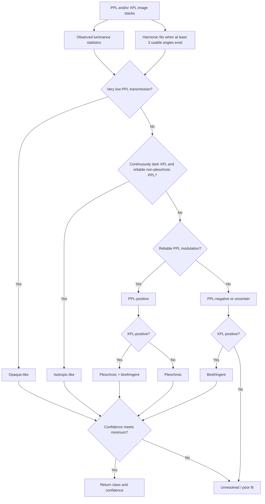
```mermaid
flowchart TD
    A["PPL and/or XPL image stacks"] --> B["Observed luminance statistics"]
    A --> C["Harmonic fits when at least 3 usable angles exist"]
    B --> D{"Very low PPL transmission?"}
    C --> D
    D -- Yes --> O["Opaque-like"]
    D -- No --> E{"Continuously dark XPL and reliable non-pleochroic PPL?"}
    E -- Yes --> I["Isotropic-like"]
    E -- No --> F{"Reliable PPL modulation?"}
    F -- Yes --> P["PPL-positive"]
    F -- No --> PN["PPL-negative or uncertain"]
    P --> H{"XPL-positive?"}
    H -- Yes --> PB["Pleochroic + birefringent"]
    H -- No --> PL["Pleochroic"]
    PN --> J{"XPL-positive?"}
    J -- Yes --> BI["Birefringent"]
    J -- No --> U["Unresolved / poor fit"]
    O --> K{"Confidence meets minimum?"}
    I --> K
    PB --> K
    PL --> K
    BI --> K
    K -- Yes --> R["Return class and confidence"]
    K -- No --> U
```

### Display, export, and reproducibility

False color changes only the visualization, not the analytical values. Cyclic hue is the default for PPL and XPL azimuths; cyclic hue shifted moves its seam by half a cycle. Cyclic twilight and cyclic twilight shifted, sampled from the corresponding Matplotlib palettes, provide perceptually smoother alternatives with different seam placement. The same color-map selector is available for false-color Image Calculator output. Viridis is the default for noncyclic scalar products, and a zero-centered diverging map is used for CPL − predicted XPL maximum. Grayscale and false-color analytical histograms include a colorbar aligned with their numerical axis; RGB and classification displays omit it. Histograms and cursor values for scalar outputs report analytical units rather than display RGB values.

NumPy and TIFF exports preserve scalar analytical values. PNG and JPEG preserve the current display mapping. For synthetic RGB products, the image display contains the calculated RGB values; scalar analytical export retains the corresponding luminance calculation. Exported analytical rasters include coordinate/provenance information so that the source roles, angles, calculation, channel, and settings can be reconstructed.

For scientific reporting, record at minimum:

- the petro-image version or commit;
- source tile-set roles and every acquisition angle;
- image registration and any illumination, exposure, flat-field, or color normalization;
- selected channel or RGB output;
- classification preset and any custom thresholds;
- export resolution and file format; and
- whether azimuth summaries used all fits or only reliable fits.

The present products quantify 2D image-coordinate optical responses. C-axis orientation, retardation, mineral composition, and mineral identity remain derivative interpretations that require additional constraints and validation; they are not outputs of the current Polarization Analysis workflow.

## Tools

### Table of Contents

- [Measure](#measure)
- [Annotate](#annotate)
- [Grid](#grid)
- [Count](#count)

### Measure

The measure tool allows simple calculation of length and area. In addition, a reference circle of a specified diameter can be enabled by clicking the  button.


| Tool                                                                                                                                              | Description                                                                                                                                                                                                                                          |
| ------------------------------------------------------------------------------------------------------------------------------------------------- | ---------------------------------------------------------------------------------------------------------------------------------------------------------------------------------------------------------------------------------------------------- |
| 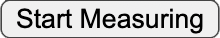 | Toggle measurement mode on. Clicking will create nodes of a polyline. Double click to finish the measurement.                                                                                                                                        |
|                    | Toggle measurement mode off. Equivalent to double clicking to finish the measurement.                                                                                                                                                                |
|                              | Adjust the appearance of the measurement annotation.                                                                                                                                                                                                 |
| 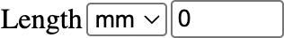                           | The length of the polyline in specified units.                                                                                                                                                                                                       |
| 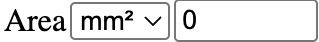                             | The area of the polygon that is defined by the polyline (requires at least three nodes). <i><b>Warning: The area is currently only accurate for simple shapes that do not involve the polyline crossing itself.</b></i>                              |
| 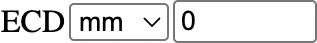                              | The equivalent circular diameter (ECD) of the polygon that is defined by the polyline (requires at least three nodes). <i><b>Warning: The ECD is currently only accurate for simple shapes that do not involve the polyline crossing itself.</b></i> |
|                       | Draw a circle that dynamically follows the curser position.                                                                                                                                                                                          |
| 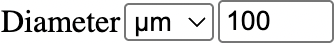                  | Specify the diameter of the circle (only used when Draw Circle is toggled on).                                                                                                                                                                       |

---

### Annotate

Annotations are a useful way to record observations and share them with collaborators. petro-image annotations use the [GeoJSON file standard](https://geojson.org/), which includes point, linestrings, polygons, and multi-part versions of these. Tools for creating points, polylines, rectangles, polygons, and ellipses are available in petro-image. Each annotation type has a specific [keyboard shortcut](#keyboard-shortcuts) in addition to being enabled by toggling buttons in the Annotate menu.

In the Desktop app, annotations for project samples are saved automatically as per-sample working GeoJSON files in the project's `annotations` folder and restored when the sample is reopened. These working files are separate from GeoJSON files created with the Export command. Legacy library JSON files remain supported; Desktop projects add a stable `sampleId` to samples that do not already have one.

> [!TIP]
> It is possible to pre-load a specimen with annotations by specifying the annotation file in the JSON. If a file is available to load, a 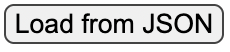 button will become available at the bottom of the Annotate menu.


| Tool                                                                                                                                                         | Description                                                                                                                                                                                                                                      |
| ------------------------------------------------------------------------------------------------------------------------------------------------------------ | ------------------------------------------------------------------------------------------------------------------------------------------------------------------------------------------------------------------------------------------------ |
| 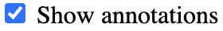 | Toggle annotations on/off.                                                                                                                                                                                                                       |
| 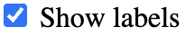       | Toggle annotation labels on/off.                                                                                                                                                                                                                 |
| 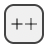             | Toggle point annotation mode. Clicking when active will create a point. <i>Shortcut: q+click or Q+click</i>                                                                                                                                      |
| 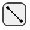              | Toggle polyline annotation mode. Clicking when active will create a node. Double-click to finish the polyline. <i>Shortcut: z+click or Z+click.</i>                                                                                              |
|          | Toggle rectangle annotation mode. Click and drag to create a rectangle. <i> Shortcut: shift+drag.</i>                                                                                                                                            |
| 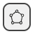           | Toggle polygon annotation mode. Clicking when active will create a node. Double-click to finish the polygon. <i> Shortcut: x+click or X+click.</i>                                                                                               |
| 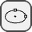              | Toggle ellipse annotation mode. Three consecutive clicks will create an ellipse. The first click defines the centroid. The second click defines the first axis. The third click defines the second axis. <i>Shortcut: c+click (three times).</i> |
|        | Go to the first annotation.                                                                                                                                                                                                                      |
| 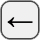    | Go to the previous annotation.                                                                                                                                                                                                                   |
| 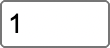     | Displays the numeric ID of the active annotation. Pressing “Enter” will result in the screen being centered on this annotation label point. The number may be changed to select and zoom to any annotation.                                      |
|         | Go to the next annotation.                                                                                                                                                                                                                       |
| 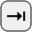        | Go to the last annotation.                                                                                                                                                                                                                       |
| 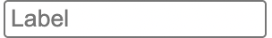  | A textbox that contains the label that will be displayed next to the annotation. If blank, no label will be displayed. <i>Note: you must present “Enter” to record the label.</i>                                                                |
|   | A textbox that contains notes related to the annotation. <i>Note: you must present “Enter” to record notes.</i>                                                                                                                                  |
|             | Delete the currently selected annotation. <i><b>Warning: This action cannot be undone.</b></i>                                                                                                                                                   |
| 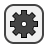              | Adjust the appearance of annotations and labels.</i>                                                                                                                                                                                             |
|             | Automatically assign the label of the currently selected annotation when new annotations are created. <i>Note: This option is only available if at least one annotation has been created.</i>                                                    |
| 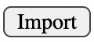            | Import a GeoJSON file with annotations.                                                                                                                                                                                                          |
|             | Export a GeoJSON file with annotations.                                                                                                                                                                                                          |
|              | Delete all annotations. <i><b>Warning: This action cannot be undone.</b></i>                                                                                                                                                                     |
|     | Load default annotations. <i>Note: this will add annotations to any you have already made.</i>                                                                                                                                                   |

### Grid

The grid tool allows one to create gridded crosshairs within a rectangular area of interest (AOI). Users can specify the extent of the AOI (as a percentage of image width and height), the grid spacing in microns, and the number of grid points. petro-image will automatically create regularly spaced crosshairs that follow a snake-like pattern from top left to bottom right. If the total number of points exceeds the amount of space available (given the AOI and step size), then an infill pattern will be used. Please refer to the [Gridding Algorithm](#gridding-algorithm) section for more details.


> [!WARNING]
> Performance issues may occur if creating a very large number of grid points (i.e., >>1000).

| Tool                                                                                                                                                        | Description                                                                                                                                                                                                                                                                                                                                                              |
| ----------------------------------------------------------------------------------------------------------------------------------------------------------- | ------------------------------------------------------------------------------------------------------------------------------------------------------------------------------------------------------------------------------------------------------------------------------------------------------------------------------------------------------------------------ |
| 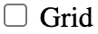        | Toggle grid crosshairs on/off.                                                                                                                                                                                                                                                                                                                                           |
| 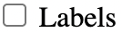 | Toggle grid labels on/off.                                                                                                                                                                                                                                                                                                                                               |
| 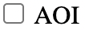    | Toggle grid area of interest (AOI) on/off.                                                                                                                                                                                                                                                                                                                               |
| 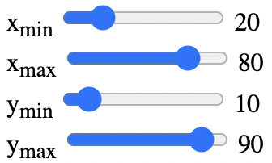    | Adjust the grid area of interest (aoi). Slider values are integers that represent percentage from 0 to 100. x<sub>min</sub> and x<sub>max</sub> indicate left and right borders of the aoi, respectively, as a percentage of image width. y<sub>min</sub> and y<sub>max</sub> indicate top and bottom borders of the aoi, respectively, as a percentage of image height. |
| 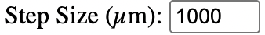   | Adjust the grid area of interest (aoi). Slider values are integers that represent percentage from 0 to 100. x<sub>min</sub> and x<sub>max</sub> indicate left and right borders of the aoi, respectively, as a percentage of image width. y<sub>min</sub> and y<sub>max</sub> indicate top and bottom borders of the aoi, respectively, as a percentage of image height. |
| 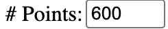   | Specify the grid step size, in microns.                                                                                                                                                                                                                                                                                                                                  |
|         | Adjust the appearance of the grid crosshairs and labels.                                                                                                                                                                                                                                                                                                                 |
|        | Create a grid by applying the selected settings. Warning: This will overwrite any existing grid or count data. Please save your progress first.                                                                                                                                                                                                                          |
|             | Delete the grid. <i><b> Warning: This will overwrite any existing grid or count data. Please save your progress first.</b></i>                                                                                                                                                                                                                                           |

### Count

A common task in microscopy is to conduct a “point count”, which involves identifying the features that fall beneath binocular crosshairs, typically using a regularly spaced grid. In petro-image, point counting functions become available if a [Grid](#grid) is created or a previously defined grid is imported. A count is recorded by inputting text or numbers into the  text box and pressing “Enter”. Pressing the spacebar will advance to the next grid crosshair and pressing shift+spacebar will advance to the previous grid crosshair. petro-image also includes some basic functions for visualizing the results of the point count, including a table of summary statistics.

> [!TIP]
> Custom grid crosshair locations (in image pixel coordinates) can be imported from a CSV file, allowing custom grid configurations.

| Tool                                                                                                                                                            | Description                                                                                                                                                                                                                                                                                                                                                                                                                                                     |
| --------------------------------------------------------------------------------------------------------------------------------------------------------------- | --------------------------------------------------------------------------------------------------------------------------------------------------------------------------------------------------------------------------------------------------------------------------------------------------------------------------------------------------------------------------------------------------------------------------------------------------------------- |
|           | Center the screen on the first grid crosshair.                                                                                                                                                                                                                                                                                                                                                                                                                  |
| 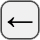       | Center the screen on the previous grid crosshair.                                                                                                                                                                                                                                                                                                                                                                                                               |
| 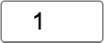     | Shows the grid crosshair that is currently selected. Pressing “Enter” will result in the screen being centered on this grid point. The number may be manually changed.                                                                                                                                                                                                                                                                                          |
| 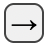           | Center the screen on the next grid crosshair.                                                                                                                                                                                                                                                                                                                                                                                                                   |
| 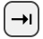           | Center the screen on the last grid crosshair.                                                                                                                                                                                                                                                                                                                                                                                                                   |
|  | A textbox in which you can enter the identifier or count label for the corresponding grid crosshair. <i><b>Note: you must present “Enter” to record the observation. The textbox will briefly be outlined in green to indicate that the data point was successfully recorded. Spaces are not allowed in this textbox, as pressing the spacebar will advance to the next grid point. Identifiers are case sensitive (e.g., “aa” is different than “AA”).</b></i> |
|       | A textbox in which you can enter notes related to the corresponding grid crosshair. <i><b>Note: you must present “Enter” to record the notes. The textbox will briefly be outlined in green to indicate that the data point was successfully recorded. Spaces are allowed in this textbox. Pressing the spacebar will not advance to the next grid point while this textbox is active.</b></i>                                                                  |
|          | Select which unique Identifiers to summarize (see below). The list will be empty until an “Identifier” has been entered for at least one grid point.                                                                                                                                                                                                                                                                                                            |
| 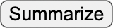      | Open a summary table with counting statistics, including the total number of counts and the number and percentage of counts for each unique text that has been entered into the “Identifier” text box. <i><b>Note: Only unique Identifiers that are selected in the “Select” menu will be shown.</i><b>                                                                                                                                                         |
| 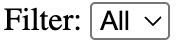         | Only show grid crosshairs that correspond to the selected unique Identifier. If “All” is selected, then all grid crosshairs will be shown.                                                                                                                                                                                                                                                                                                                      |
| 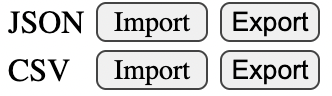 | Import or export a JSON or CSV file with point count data. <i><b>Note: Grid crosshair appearances will only be saved if the point counts are exported as a JSON.</b></i>                                                                                                                                                                                                                                                                                        |

---

## Appendix

### Keyboard Shortcuts

| Tool           | Description                                      |
| -------------- | ------------------------------------------------ |
| ctrl+scroll    | Change image rotation angle                      |
| ctrl+1         | Toggle base image on/off                         |
| ctrl+2         | Toggle 2nd image on/off (if available)           |
| ctrl+3         | Toggle 3rd image on/off (if available)           |
| ctrl+3         | Toggle 4rd image on/off (if available)           |
| q+click        | Make a point                                     |
| z+click        | Make a polyline                                  |
| shift+drag     | Make a rectangle                                 |
| x+click        | Make a polygon                                   |
| c+click        | Make an ellipse                                  |
| spacebar       | Advance to next crosshair (when Grid active)     |
| shift+spacebar | Advance to previous crosshair (when Grid active) |

### JSON File Structure

To load your own images, you must format a JSON file as shown below. There are three ways of displaying images, which differ in the way that `tileSets` is defined. Option 1: A single image in a tileset (shown as PPL (0°) below). Option 2: Multiple images in a tileset that are linked with image rotation angle (shown as XPL (multi-pol) below) `periodDegrees` indicates the frequency of image repetition during rotation. Option 3: Multiple images in a tileset that can be toggled in sequence, each with their own label (e.g., shown as Reflected and Reflected-pol below).

> [!NOTE]
> "annotations" are optional.

> [!NOTE]
> The JSON file structure was updated Oct 16, 2025. A Rust program is available for converting the old format to the new one.

<pre>
{
  "format": "v1",
  "samples": [
    {
      "groups": ["Favorites"],
      "title": "MT-2 02 (test for GitHub)",
      "description": "MT-2",
      "unit": "2",
      "pixelsPerUnit": "0.398",
      "pixelsPerMeter": "398000",
      "tileSets": [
        {
          "label": "PPL (0°)",
          "tiles": [
            {
              "uri": "https://raw.githubusercontent.com/uacsrg/image-storage3/main/images/MT-2 02 2.5x PPL00_v2_final.dzi"
            }
          ]
        },
        {
          "label": "XPL (mult-pol)",
          "periodDegrees": 90,
          "tiles": [
            {
              "uri": "https://raw.githubusercontent.com/uacsrg/image-storage3/main/images/MT-2 02 2.5x XPL00 final.dzi",
              "angleDegrees": 0
            },
            {
              "uri": "https://raw.githubusercontent.com/uacsrg/image-storage3/main/images/MT-2 02 2.5x XPL15 final.dzi",
              "angleDegrees": 15
            },
            {
              "uri": "https://raw.githubusercontent.com/uacsrg/image-storage3/main/images/MT-2 02 2.5x XPL30 final.dzi",
              "angleDegrees": 30
            },
            {
              "uri": "https://raw.githubusercontent.com/uacsrg/image-storage3/main/images/MT-2 02 2.5x XPL45 final.dzi",
              "angleDegrees": 45
            },
            {
              "uri": "https://raw.githubusercontent.com/uacsrg/image-storage3/main/images/MT-2 02 2.5x XPL60 final.dzi",
              "angleDegrees": 60
            },
            {
              "uri": "https://raw.githubusercontent.com/uacsrg/image-storage3/main/images/MT-2 02 2.5x XPL75 final.dzi",
              "angleDegrees": 75
            }
          ]
        },
        {
          "tiles": [
            {
              "label": "Reflected",
              "uri": "https://raw.githubusercontent.com/uacsrg/image-storage3/main/images/MT-2 02 2.5x REF final.dzi"
            },
            {
              "label": "Reflected-pol",
              "uri": "https://raw.githubusercontent.com/uacsrg/image-storage3/main/images/MT-2 02 2.5x REF final.dzi"
            }
          ]
        }
      ]
    }
  ]
}
</pre>

### Layer Explanation

petro-image may display up to four images simultaneously (with support for 5+ images planned in the future). The image below shows how layers are vertically superimposed.

> [!NOTE]
> The first image should be the base layer over which the other images will be shown.

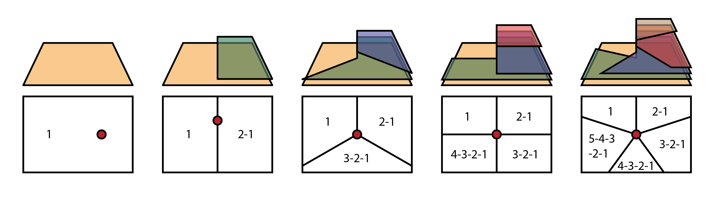

### Gridding Algorithm

petro-image creates grid crosshairs by using a snake-like pattern from top left to bottom right. If the total number of points is greater than the space available (defined by the size of the area of interest and the specified step size), then an infill pattern is used wherein the step sized is halved in subsequent points. No two grid crosshairs will occupy the same location.

> [!TIP]
> It is a good idea to select an appropriate step size such that you have enough space for the desired number of grid crosshairs. This will avoid the use of an infill pattern.


