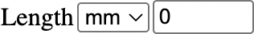
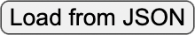
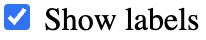
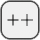
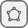
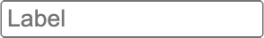
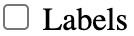
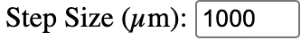

# petro-image

An open-source, web-based platform for exploring and analyzing high-resolution digital microscopic images.

**Try it out here**: [https://gsharman.github.io/petro-image/](https://gsharman.github.io/petro-image/)

By [Glenn R. Sharman](https://github.com/grsharman) and [Jonathan P. Sharman](https://github.com/jonathansharman)

## Table of Contents

- [Overview](#overview)
- [Image Selection](#image-selection)
- [Adding Your Own Images](#adding-your-own-images)
- [Tools](#tools)
- [Appendix](#appendix)

## Overview

petro-image is a web-hosted tool for viewing and analyzing digital microsopic images using the [OpenSeadragon](https://openseadragon.github.io/) JavaScript library and the [Deep Zoom](<https://learn.microsoft.com/en-us/previous-versions/windows/silverlight/dotnet-windows-silverlight/cc645077(v=vs.95)?redirectedfrom=MSDN>) file format. Vector drawings follow the [GeoJSON file standard](https://geojson.org/), where x, y coordinates are in image dimensions (pixels).

For a given specimen, petro-image allows up to four images to be displayed simultaneously, with the boundary between the images dynamically following the user's curser (inspired by [this example](https://rooneyt.msu.domains/Demonstration_1.html)). Alternatively, images may be superimposed and opacity adjusted such that multiple layers are visible simultaneously.

petro-image includes basic functions for [measuring](#measure), [annotating](#annotate), [gridding](#grid), and [point counting](#count).

At present, petro-image mostly hosts petrographic thin sections of sediment and sedimentary rock. If you would like to contribute specimens to the petro-image library or have suggestions for improvements, please contact Dr. Glenn Sharman at gsharman@uark.edu.

## Image Selection

<b><i>petro-image</i></b> has two drop-down menus. The top menu is used to select a group of specimens, and the bottom menu is used to select the specimen or sample of interest. Setting the top menu to "All" will return all availble specimens.

Individual specimens can have between 1 and 4 images that can be displayed simultaneously. Individual images may be toggled on/off using the checkboxes.

Clicking on the  button will enable a set of options that include toggling on/off the “Divide Images” setting and adjusting the opacity of the individual layers. See [Layer Explanation](#layer-explanation) for an explanation of how images are superimposed. Clicking on the  button allows the user to upload a custom JSON that contains their own images for display (see the [Adding Your Own Images](#adding-your-own-images) and [JSON File Structure](#json-file-structure) sections for more information).

Hovering your curser over the  icon will display a description of the sample, if available.

## Adding Your Own Images

1. Acquire one or more digital images of your sample. Most of the images currently hosted on petro-image were created using the [PiAutoStage](https://sites.google.com/msu.edu/piautostage/home), which is described in [Reiner and Rooney (2021)](https://doi.org/10.1029/2021GC009693).
2. Convert digital image(s) (e.g., TIF, JPG) to the deep-zoom file format, which consists of a DZI file and an associated folder with tiled images. A variety of [methods for converting to deep-zoom files](https://openseadragon.github.io/examples/creating-zooming-images/) are available.
3. Make the DZI files publicly available on the web. Uploading the files to a public GitHub repository is one way to do this. Determine the URL that points to the DZI file for each image.
4. Create a JSON file that contains an entry for each specimen, which could have one or more associated images. See the [JSON File Structure](#json-file-structure) section for details.
5. Load the JSON file into petro-image by clicking on the  icon followed by the  button on the pop-up menu.

> [!NOTE]
> If using more than one image, they should align as closely > as possible and have the same number of rows and columns.

  <strong>📝 Note:</strong> you must know pixel dimensions of your image(s).

## Tools

### Table of Contents

- [Measure](#measure)
- [Annotate](#annotate)
- [Grid](#grid)
- [Count](#count)

### Measure

The measure tool allows simple calculation of length and area. In addition, a reference circle of a specified diameter can be enabled by clicking the  button.

| Tool                                                                                                                                              | Description                                                                                                                                                                                                                                          |
| ------------------------------------------------------------------------------------------------------------------------------------------------- | ---------------------------------------------------------------------------------------------------------------------------------------------------------------------------------------------------------------------------------------------------- |
|  | Toggle measurement mode on. Clicking will create nodes of a polyline. Double click to finish the measurement.                                                                                                                                        |
|                    | Toggle measurement mode off. Equivalent to double clicking to finish the measurement.                                                                                                                                                                |
|                              | Adjust the appearance of the measurement annotation.                                                                                                                                                                                                 |
|                            | The length of the polyline in specified units.                                                                                                                                                                                                       |
|                              | The area of the polygon that is defined by the polyline (requires at least three nodes). <i><b>Warning: The area is currently only accurate for simple shapes that do not involve the polyline crossing itself.</b></i>                              |
|                               | The equivalent circular diameter (ECD) of the polygon that is defined by the polyline (requires at least three nodes). <i><b>Warning: The ECD is currently only accurate for simple shapes that do not involve the polyline crossing itself.</b></i> |
|                       | Draw a circle that dynamically follows the curser position.                                                                                                                                                                                          |
|                   | Specify the diameter of the circle (only used when Draw Circle is toggled on).                                                                                                                                                                       |

---

### Annotate

Annotations are a useful way to record observations and share them with collaborators. petro-image annotations use the [GeoJSON file standard](https://geojson.org/), which includes point, linestrings, polygons, and multi-part versions of these. Tools for creating points, polylines, rectangles, polygons, and ellipses are available in petro-image. Each annotation type has a specific [keyboard shortcut](#keyboard-shortcuts) in addition to being enabled by toggling buttons in the Annotate menu.

  <strong>📝 Note:</strong> it is possible to pre-load a specimen with annotations by specifying the annotation file in the JSON. If a file is available to load, a  button will become available at the bottom of the Annotate menu.

| Tool                                                                                                                                                         | Description                                                                                                                                                                                                                                      |
| ------------------------------------------------------------------------------------------------------------------------------------------------------------ | ------------------------------------------------------------------------------------------------------------------------------------------------------------------------------------------------------------------------------------------------ |
|  | Toggle annotations on/off.                                                                                                                                                                                                                       |
|        | Toggle annotation labels on/off.                                                                                                                                                                                                                 |
|              | Toggle point annotation mode. Clicking when active will create a point. <i>Shortcut: q+click or Q+click</i>                                                                                                                                      |
|               | Toggle polyline annotation mode. Clicking when active will create a node. Double-click to finish the polyline. <i>Shortcut: z+click or Z+click.</i>                                                                                              |
|          | Toggle rectangle annotation mode. Click and drag to create a rectangle. <i> Shortcut: shift+drag.</i>                                                                                                                                            |
|            | Toggle polygon annotation mode. Clicking when active will create a node. Double-click to finish the polygon. <i> Shortcut: x+click or X+click.</i>                                                                                               |
|               | Toggle ellipse annotation mode. Three consecutive clicks will create an ellipse. The first click defines the centroid. The second click defines the first axis. The third click defines the second axis. <i>Shortcut: c+click (three times).</i> |
|        | Go to the first annotation.                                                                                                                                                                                                                      |
|     | Go to the previous annotation.                                                                                                                                                                                                                   |
|      | Displays the numeric ID of the active annotation. Pressing “Enter” will result in the screen being centered on this annotation label point. The number may be changed to select and zoom to any annotation.                                      |
|         | Go to the next annotation.                                                                                                                                                                                                                       |
|         | Go to the last annotation.                                                                                                                                                                                                                       |
|   | A textbox that contains the label that will be displayed next to the annotation. If blank, no label will be displayed. <i>Note: you must present “Enter” to record the label.</i>                                                                |
|   | A textbox that contains notes related to the annotation. <i>Note: you must present “Enter” to record notes.</i>                                                                                                                                  |
|             | Delete the currently selected annotation. <i><b>Warning: This action cannot be undone.</b></i>                                                                                                                                                   |
|               | Adjust the appearance of annotations and labels.</i>                                                                                                                                                                                             |
|             | Automatically assign the label of the currently selected annotation when new annotations are created. <i>Note: This option is only available if at least one annotation has been created.</i>                                                    |
|             | Import a GeoJSON file with annotations.                                                                                                                                                                                                          |
|             | Export a GeoJSON file with annotations.                                                                                                                                                                                                          |
|              | Delete all annotations. <i><b>Warning: This action cannot be undone.</b></i>                                                                                                                                                                     |
|     | Load default annotations. <i>Note: this will add annotations to any you have already made.</i>                                                                                                                                                   |

### Grid

The grid tool allows one to create gridded crosshairs within a rectangular area of interest (AOI). Users can specify the extent of the AOI (as a percentage of image width and height), the grid spacing in microns, and the number of grid points. petro-image will automatically create regularly spaced crosshairs that follow a snake-like pattern from top left to bottom right. If the total number of points exceeds the amount of space available (given the AOI and step size), then an infill pattern will be used. Please refer to the [Gridding Algorithm](#gridding-algorithm) section for more details.

  <strong>📝 Note:</strong> performance issues may occur if creating a very large number of grid points (i.e., >>1000).

| Tool                                                                                                                                                        | Description                                                                                                                                                                                                                                                                                                                                                              |
| ----------------------------------------------------------------------------------------------------------------------------------------------------------- | ------------------------------------------------------------------------------------------------------------------------------------------------------------------------------------------------------------------------------------------------------------------------------------------------------------------------------------------------------------------------ |
|         | Toggle grid crosshairs on/off.                                                                                                                                                                                                                                                                                                                                           |
|  | Toggle grid labels on/off.                                                                                                                                                                                                                                                                                                                                               |
|     | Toggle grid area of interest (AOI) on/off.                                                                                                                                                                                                                                                                                                                               |
|     | Adjust the grid area of interest (aoi). Slider values are integers that represent percentage from 0 to 100. xmin and xmax indicate left and right borders of the aoi, respectively, as a percentage of image width. ymin and ymax indicate top and bottom borders of the aoi, respectively, as a percentage of image height. |
|    | Adjust the grid area of interest (aoi). Slider values are integers that represent percentage from 0 to 100. xmin and xmax indicate left and right borders of the aoi, respectively, as a percentage of image width. ymin and ymax indicate top and bottom borders of the aoi, respectively, as a percentage of image height. |
|    | Specify the grid step size, in microns.                                                                                                                                                                                                                                                                                                                                  |
|         | Adjust the appearance of the grid crosshairs and labels.                                                                                                                                                                                                                                                                                                                 |
|        | Create a grid by applying the selected settings. Warning: This will overwrite any existing grid or count data. Please save your progress first.                                                                                                                                                                                                                          |
|             | Delete the grid. <i><b> Warning: This will overwrite any existing grid or count data. Please save your progress first.</b></i>                                                                                                                                                                                                                                           |

### Count

A common task in microscopy is to conduct a “point count”, which involves identifying the features that fall beneath binocular crosshairs, typically using a regularly spaced grid. In petro-image, point counting functions become available if a [Grid](#grid) is created or a previously defined grid is imported. A count is recorded by inputting text or numbers into the  text box and pressing “Enter”. Pressing the spacebar will advance to the next grid crosshair and pressing shift+spacebar will advance to the previous grid crosshair. petro-image also includes some basic functions for visualizing the results of the point count, including a table of summary statistics.

  <strong>📝 Note:</strong> custom grid crosshair locations (in image pixel coordinates) can be imported from a CSV file, allowing custom grid configurations.

| Tool                                                                                                                                                            | Description                                                                                                                                                                                                                                                                                                                                                                                                                                                     |
| --------------------------------------------------------------------------------------------------------------------------------------------------------------- | --------------------------------------------------------------------------------------------------------------------------------------------------------------------------------------------------------------------------------------------------------------------------------------------------------------------------------------------------------------------------------------------------------------------------------------------------------------- |
|           | Center the screen on the first grid crosshair.                                                                                                                                                                                                                                                                                                                                                                                                                  |
|        | Center the screen on the previous grid crosshair.                                                                                                                                                                                                                                                                                                                                                                                                               |
|      | Shows the grid crosshair that is currently selected. Pressing “Enter” will result in the screen being centered on this grid point. The number may be manually changed.                                                                                                                                                                                                                                                                                          |
|            | Center the screen on the next grid crosshair.                                                                                                                                                                                                                                                                                                                                                                                                                   |
|            | Center the screen on the last grid crosshair.                                                                                                                                                                                                                                                                                                                                                                                                                   |
|  | A textbox in which you can enter the identifier or count label for the corresponding grid crosshair. <i><b>Note: you must present “Enter” to record the observation. The textbox will briefly be outlined in green to indicate that the data point was successfully recorded. Spaces are not allowed in this textbox, as pressing the spacebar will advance to the next grid point. Identifiers are case sensitive (e.g., “aa” is different than “AA”).</b></i> |
|       | A textbox in which you can enter notes related to the corresponding grid crosshair. <i><b>Note: you must present “Enter” to record the notes. The textbox will briefly be outlined in green to indicate that the data point was successfully recorded. Spaces are allowed in this textbox. Pressing the spacebar will not advance to the next grid point while this textbox is active.</b></i>                                                                  |
|          | Select which unique Identifiers to summarize (see below). The list will be empty until an “Identifier” has been entered for at least one grid point.                                                                                                                                                                                                                                                                                                            |
|       | Open a summary table with counting statistics, including the total number of counts and the number and percentage of counts for each unique text that has been entered into the “Identifier” text box. <i><b>Note: Only unique Identifiers that are selected in the “Select” menu will be shown.</i><b>                                                                                                                                                         |
|          | Only show grid crosshairs that correspond to the selected unique Identifier. If “All” is selected, then all grid crosshairs will be shown.                                                                                                                                                                                                                                                                                                                      |
|  | Import or export a JSON or CSV file with point count data. <i><b>Note: Grid crosshair appearances will only be saved if the point counts are exported as a JSON.</b></i>                                                                                                                                                                                                                                                                                        |

---

## Appendix

### Keyboard Shortcuts

| Tool           | Description                                      |
| -------------- | ------------------------------------------------ |
| ctrl+1         | Toggle base image on/off                         |
| ctrl+2         | Toggle 2nd image on/off (if available)           |
| ctrl+3         | Toggle 3rd image on/off (if available)           |
| ctrl+3         | Toggle 4rd image on/off (if available)           |
| q+click        | Make a point                                     |
| z+click        | Make a polyline                                  |
| shift+drag     | Make a rectangle                                 |
| x+click        | Make a polygon                                   |
| c+click        | Make an ellipse                                  |
| spacebar       | Advance to next crosshair (when Grid active)     |
| shift+spacebar | Advance to previous crosshair (when Grid active) |

### JSON File Structure

To load your own images, you must format a JSON file as shown below.

  <strong>📝 Note:</strong> <code>annotations</code> are optional.

<pre>
{
  "SD0004": {
    "groups": ["Favorites", "SedGeo"],
    "title": "SD0004",
    "description": "Budhir, Iceland",
    "unit": "2",
    "pixelsPerUnit": "0.398",
    "pixelsPerMeter": "398000",
    "tileLabels": ["PPL(0°)", "XPL(0°)", "XPL(30°)"],
    "tileSets": [
      "https://raw.githubusercontent.com/grsharman/image-storage4/main/images/SD0004 01 2.5x PPL00 final.dzi",
      "https://raw.githubusercontent.com/grsharman/image-storage4/main/images/SD0004 01 2.5x XPL00 final.dzi",
      "https://raw.githubusercontent.com/grsharman/image-storage4/main/images/SD0004 01 2.5x XPL30 final.dzi"
    ],
    "annotations": "https://raw.githubusercontent.com/grsharman/petro-image/refs/heads/main/annotations/SD0004_medium_all_polygons_by_rect.geojson"
  }
}
</pre>

### Layer Explanation

petro-image may display up to four images simultaneously. The image below shows how layers are vertically superimposed.

  <strong>📝 Note:</strong> The first image should be the base layer over which the other images will be shown.

### Gridding Algorithm

petro-image creates grid crosshairs by using a snake-like pattern from top left to bottom right. If the total number of points is greater than the space available (defined by the size of the area of interest and the specified step size), then an infill pattern is used wherein the step sized is halved in subsequent points. No two grid crosshairs will occupy the same location.

  <strong>📝 Note:</strong> it is a good idea to select an appropriate step size such that you have enough space for the desired number of grid crosshairs. This will avoid the use of an infill pattern.

